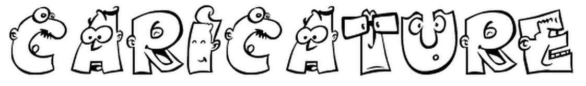
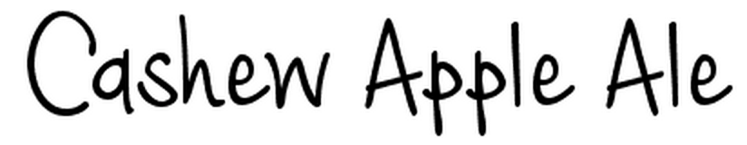
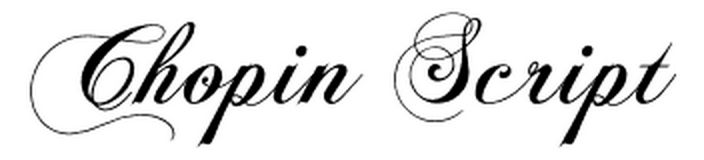

# C Fonts

###cabin

[cabin](../../Fonts/C/cabin)

###cabinsketch

[cabinsketch](../../Fonts/C/cabinsketch)

###CAC-Champagne

[CAC-Champagne](../../Fonts/C/CAC-Champagne)

###Cafe_Brewery

[Cafe_Brewery](../../Fonts/C/cafe_brewery)

###calligraffiti

[calligraffiti](../../Fonts/C/calligraffiti)

###cambo

[cambo](../../Fonts/C/cambo)

###candal

[candal](../../Fonts/C/candal)

###Candela

[Candela](../../Fonts/C/Candela)

###Candlescript

[Candlescript](../../Fonts/C/candlescript)

###Canela_Bark

[Canela_Bark](../../Fonts/C/canela_bark)

###cantarell

[cantarell](../../Fonts/C/cantarell)

###capsuula

[capsuula](../../Fonts/C/capsuula)

###Caricature

[Caricature](../../Fonts/C/caricature)

###Carnevalee_Freakshow

[Carnevalee_Freakshow](../../Fonts/C/carnevalee_freakshow)

###Capture-it

[Capture-it](../../Fonts/C/Capture-it)

###CarbonType

[CarbonType](../../Fonts/C/CarbonType)

###Cardo

[Cardo](../../Fonts/C/Cardo)

###Carousel

[Carousel](../../Fonts/C/Carousel)

###Carrington

[Carrington](../../Fonts/C/Carrington)

###carrois-gothic

[carrois-gothic](../../Fonts/C/carrois-gothic)

###Cash_Currency

[Cash_Currency](../../Fonts/C/cash_currency)

###Cashew_Apple_Ale

[Cashew_Apple_Ale](../../Fonts/C/cashew_apple_ale)

###Caslon-Initials

[Caslon-Initials](../../Fonts/C/Caslon-Initials)

###caudex

[caudex](../../Fonts/C/caudex)

###Caviar-Dreams

[Caviar-Dreams](../../Fonts/C/Caviar-Dreams)

###ceviche-one

[ceviche-one](../../Fonts/C/ceviche-one)

###Chalk_Hand_Lettering_Shaded

[Chalk_Hand_Lettering_Shaded](../../Fonts/C/chalk_hand_lettering_shaded)

###Champagne_Limousines

[Champagne_Limousines](../../Fonts/C/champagne_limousines)

###Champignon

[Champignon](../../Fonts/C/champignon)

###Channel

[Channel](../../Fonts/C/Channel)

###Chantelli-Antiqua

[Chantelli-Antiqua](../../Fonts/C/Chantelli-Antiqua)

###ChanticleerRoman

[ChanticleerRoman](../../Fonts/C/ChanticleerRoman)

###Charis-SIL

[Charis-SIL](../../Fonts/C/Charis-SIL)

###Cheddar_Jack

[Cheddar_Jack](../../Fonts/C/cheddar_jack)

###cheri

[cheri](../../Fonts/C/cheri)

###cherry-swash

[cherry-swash](../../Fonts/C/cherry-swash)

###Chevalier_de_lorimier

[Chevalier_de_lorimier](../../Fonts/C/cf_chevalier_de_lorimier)

###chivo

[chivo](../../Fonts/C/chivo)

###Chocolate_Dealer

[Chocolate_Dealer](../../Fonts/C/chocolate_dealer)

###Chopin_Script

[Chopin_Script](../../Fonts/C/chopin_script)

###ChunkFive

[ChunkFive](../../Fonts/C/ChunkFive)

###Chunk_Five_Ex

[Chunk_Five_Ex](../../Fonts/C/chunkfive_ex)

###Cicle

[Cicle](../../Fonts/C/Cicle)

###cinzel

[cinzel](../../Fonts/C/cinzel)

###Circus

[Circus](../../Fonts/C/circus)

###Cityscape

[Cityscape](../../Fonts/C/cityscape_font)

###clear-sans

[clear-sans](../../Fonts/C/clear-sans)

###Clemente

[Clemente](../../Fonts/C/clemente_pd)

###Cloister_Black

[Cloister_Black](../../Fonts/C/cloister_black)

###Clutchee

[Clutchee](../../Fonts/C/Clutchee)

###Coalhand_Luke

[Coalhand_Luke](../../Fonts/C/coalhandluke)

###Coalition

[Coalition](../../Fonts/C/coalition)

###Cocogoose

[Cocogoose](../../Fonts/C/cocogoose)

###Cocogoose_Letterpress

[Cocogoose_Letterpress](../../Fonts/C/cocogoose_letterpress)

###Cocomat

[Cocomat](../../Fonts/C/cocomat)

###coda

[coda](../../Fonts/C/coda)

###code

[code](../../Fonts/C/code)

###Colaborate

[Colaborate](../../Fonts/C/Colaborate)

###College

[College](../../Fonts/C/College)

###Colors_Of_Autumn

[Colors_Of_Autumn](../../Fonts/C/colors_of_autumn)

###CombiNumerals-Ltd

[CombiNumerals-Ltd](../../Fonts/C/CombiNumerals-Ltd)

###comic-relief

[comic-relief](../../Fonts/C/comic-relief)

###Comic-Zine-OT

[Comic-Zine-OT](../../Fonts/C/Comic-Zine-OT)

###Commando

[Commando](../../Fonts/C/Commando)

###comme

[comme](../../Fonts/C/comme)

###Communist

[Communist](../../Fonts/C/Communist)

###condiment

[condiment](../../Fonts/C/condiment)

###Coneria_Script

[Coneria_Script](../../Fonts/C/coneria_script)

###Contra

[Contra](../../Fonts/C/Contra)

###Coolvetica

[Coolvetica](../../Fonts/C/coolvetica)

###cooper-hewitt

[cooper-hewitt](../../Fonts/C/cooper-hewitt)

###copse

[copse](../../Fonts/C/copse)

###Copystruct

[Copystruct](../../Fonts/C/Copystruct)

###Corbert

[Corbert](../../Fonts/C/corbert)

###Corbert Condensed

[Corbert Condensed](../../Fonts/C/corbert-condensed)

###Corda

[Corda](../../Fonts/C/corda)

###Corehumanist Sans

[Corehumanist Sans](../../Fonts/C/corehumanistsans)

###Cosmo Stitch

[Cosmo Stitch](../../Fonts/C/Cosmo_Stitch)

###Costura

[Costura](../../Fonts/C/Costura)

###courier-prime

[courier-prime](../../Fonts/C/courier-prime)

###cousine

[cousine](../../Fonts/C/cousine)

###Couture

[Couture](../../Fonts/C/couture)

###cowboy-hippie-pro

[cowboy-hippie-pro](../../Fonts/C/cowboy-hippie-pro)

###Credit-Valley

[Credit-Valley](../../Fonts/C/Credit-Valley)

###Cresent

[Cresent](../../Fonts/C/cresent)

###crete-round

[crete-round](../../Fonts/C/crete-round)

###crimson

[crimson](../../Fonts/C/crimson)

###cuprum

[cuprum](../../Fonts/C/cuprum)

###Cute_Cartoon

[Cute_Cartoon](../../Fonts/C/cute_cartoon)

###SF-Cartoonist-Hand

[SF-Cartoonist-Hand](../../Fonts/C/SF-Cartoonist-Hand)

###SF-Collegiate

[SF-Collegiate](../../Fonts/C/SF-Collegiate)

