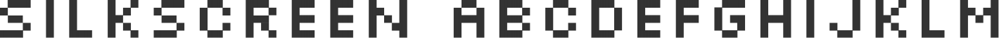
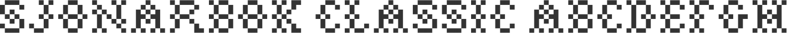

###sail

[sail](../../Fonts/S/sail)

###Salaryman

[Salaryman](../../Fonts/S/Salaryman)

###Samba

[Samba](../../Fonts/S/Samba)

###sanchez

[sanchez](../../Fonts/S/sanchez)

###sansation

[sansation](../../Fonts/S/sansation)

###sansita

[sansita](../../Fonts/S/sansita)

###Sansumi

[Sansumi](../../Fonts/S/Sansumi)

###Santana

[Santana](../../Fonts/S/Santana)

###saxMono

[saxMono](../../Fonts/S/saxMono)

###scifly

[scifly](../../Fonts/S/scifly)

###Scratch-my-back

[Scratch-my-back](../../Fonts/S/Scratch-my-back)

###Scratch

[Scratch](../../Fonts/S/Scratch)

###scriptina-pro

[scriptina-pro](../../Fonts/S/scriptina-pro)

###Scriptina

[Scriptina](../../Fonts/S/Scriptina)

###sears-tower

[sears-tower](../../Fonts/S/sears-tower)

###SeasideResortNF

[SeasideResortNF](../../Fonts/S/SeasideResortNF)

###Secret-Typewriter

[Secret-Typewriter](../../Fonts/S/Secret-Typewriter)

###sedgwick-co

[sedgwick-co](../../Fonts/S/sedgwick-co)

###selfish

[selfish](../../Fonts/S/selfish)

###Serif-Beta

[Serif-Beta](../../Fonts/S/Serif-Beta)

###Sesquipedalian

[Sesquipedalian](../../Fonts/S/Sesquipedalian)

###sevillana

[sevillana](../../Fonts/S/sevillana)

###SF-Shai-Fontai

[SF-Shai-Fontai](../../Fonts/S/SF-Shai-Fontai)

###SF-Slapstick-Comic

[SF-Slapstick-Comic](../../Fonts/S/SF-Slapstick-Comic)

###SF-Speakeasy

[SF-Speakeasy](../../Fonts/S/SF-Speakeasy)

###ShangriLaNF

[ShangriLaNF](../../Fonts/S/ShangriLaNF)

###shanti

[shanti](../../Fonts/S/shanti)

###share-regular

[share-regular](../../Fonts/S/share-regular)

###Shlop

[Shlop](../../Fonts/S/Shlop)

###short-stack

[short-stack](../../Fonts/S/short-stack)

###shortcut

[shortcut](../../Fonts/S/shortcut)

###sigmar

[sigmar](../../Fonts/S/sigmar)

###signika

[signika](../../Fonts/S/signika)

###Silkscreen

[Silkscreen](../../Fonts/S/Silkscreen)

###simonetta

[simonetta](../../Fonts/S/simonetta)

###sina-nova

[sina-nova](../../Fonts/S/sina-nova)

###sinkin-sans

[sinkin-sans](../../Fonts/S/sinkin-sans)

###sintony

[sintony](../../Fonts/S/sintony)

###SirucaPictograms

[SirucaPictograms](../../Fonts/S/SirucaPictograms)

###six-caps

[six-caps](../../Fonts/S/six-caps)

###Sjonarbok-Classic

[Sjonarbok-Classic](../../Fonts/S/Sjonarbok-Classic)

###Sketchetica

[Sketchetica](../../Fonts/S/Sketchetica)

###skyhook-mono

[skyhook-mono](../../Fonts/S/skyhook-mono)

###slabo

[slabo](../../Fonts/S/slabo)

###Sling

[Sling](../../Fonts/S/Sling)

###Slukoni

[Slukoni](../../Fonts/S/Slukoni)

###smokum

[smokum](../../Fonts/S/smokum)

###Snickles

[Snickles](../../Fonts/S/Snickles)

###sniglet

[sniglet](../../Fonts/S/sniglet)

###snippet

[snippet](../../Fonts/S/snippet)

###sofadi-one

[sofadi-one](../../Fonts/S/sofadi-one)

###sofia-pro-condensed

[sofia-pro-condensed](../../Fonts/S/sofia-pro-condensed)

###sofia-pro

[sofia-pro](../../Fonts/S/sofia-pro)

###sofia

[sofia](../../Fonts/S/sofia)

###Soft-Sugar-plain

[Soft-Sugar-plain](../../Fonts/S/Soft-Sugar-plain)

###sonsie-one

[sonsie-one](../../Fonts/S/sonsie-one)

###sonus

[sonus](../../Fonts/S/sonus)

###SorbetLTD

[SorbetLTD](../../Fonts/S/SorbetLTD)

###Sorts-Mill-Goudy

[Sorts-Mill-Goudy](../../Fonts/S/Sorts-Mill-Goudy)

###SouciSans

[SouciSans](../../Fonts/S/SouciSans)

###source-code-pro

[source-code-pro](../../Fonts/S/source-code-pro)

###source-sans-pro

[source-sans-pro](../../Fonts/S/source-sans-pro)

###source-serif-pro

[source-serif-pro](../../Fonts/S/source-serif-pro)

###Sovba-Regular

[Sovba-Regular](../../Fonts/S/Sovba-Regular)

###sovereign-regular

[sovereign-regular](../../Fonts/S/sovereign-regular)

###special-elite

[special-elite](../../Fonts/S/special-elite)

###spicy-rice

[spicy-rice](../../Fonts/S/spicy-rice)

###Spilt-Ink

[Spilt-Ink](../../Fonts/S/Spilt-Ink)

###Spin-Cycle-OT

[Spin-Cycle-OT](../../Fonts/S/Spin-Cycle-OT)

###spinwerad

[spinwerad](../../Fonts/S/spinwerad)

###spirequal-Light

[spirequal-Light](../../Fonts/S/spirequal-Light)

###sportrop

[sportrop](../../Fonts/S/sportrop)

###sports-world

[sports-world](../../Fonts/S/sports-world)

###springsteel-serif

[springsteel-serif](../../Fonts/S/springsteel-serif)

###Springsteel

[Springsteel](../../Fonts/S/Springsteel)

###st-marie

[st-marie](../../Fonts/S/st-marie)

###st-ryde

[st-ryde](../../Fonts/S/st-ryde)

###stardos-stencil

[stardos-stencil](../../Fonts/S/stardos-stencil)

###stateface

[stateface](../../Fonts/S/stateface)

###steelfish

[steelfish](../../Fonts/S/steelfish)

###Streetwise-buddy

[Streetwise-buddy](../../Fonts/S/Streetwise-buddy)

###Studebaker

[Studebaker](../../Fonts/S/Studebaker)

###surface

[surface](../../Fonts/S/surface)

###Sybil-Green

[Sybil-Green](../../Fonts/S/Sybil-Green)

###Symbol-Signs

[Symbol-Signs](../../Fonts/S/Symbol-Signs)

###Synthetique

[Synthetique](../../Fonts/S/Synthetique)

