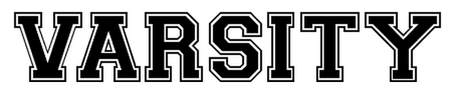

# V Fonts

###VAG-HandWritten

[VAG-HandWritten](../../Fonts/V/VAG-HandWritten)

###VanBerger

[VanBerger](../../Fonts/V/VanBerger)

###Vanilla

[Vanilla](../../Fonts/V/Vanilla)

###varela-round

[varela-round](../../Fonts/V/varela-round)

###varela

[varela](../../Fonts/V/varela)

###Varsity

[Varsity](../../Fonts/V/varsity_regular)

###vast-shadow

[vast-shadow](../../Fonts/V/vast-shadow)

###Veggieburger

[Veggieburger](../../Fonts/V/Veggieburger)

###Verily-Serif-Mono

[Verily-Serif-Mono](../../Fonts/V/Verily-Serif-Mono)

###vidaloka

[vidaloka](../../Fonts/V/vidaloka)

###viga

[viga](../../Fonts/V/viga)

###Virgo-01

[Virgo-01](../../Fonts/V/Virgo-01)

###Vitamin

[Vitamin](../../Fonts/V/Vitamin)

###volkhov

[volkhov](../../Fonts/V/volkhov)

###vollkorn

[vollkorn](../../Fonts/V/vollkorn)

###voltaire

[voltaire](../../Fonts/V/voltaire)

###VTC-Letterer-Pro

[VTC-Letterer-Pro](../../Fonts/V/VTC-Letterer-Pro)

